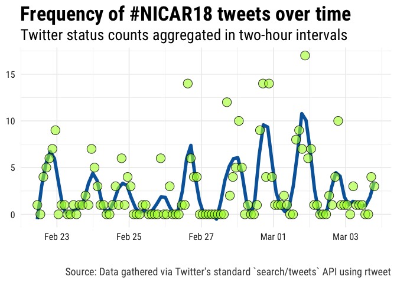
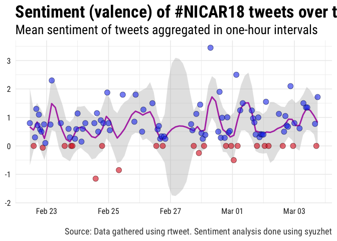

\#NICAR18 Tweets
================
A repository for tracking [\#NICAR18
tweets](https://twitter.com/hashtag/NICAR18?f=tweets&vertical=default&src=hash),
the official hashtag of 2018 annual Computer-Assisted Reporting
Conference.

## Data

Two data collection methods are described in detail below. Hoewver, if
you want to skip straight to the data, run the following code:

``` r
## download status IDs file
download.file(
  "https://github.com/computer-assisted-reporting/NICAR18/blob/master/data/search-ids.rds?raw=true",
  "NICAR18_status_ids.rds"
)

## read status IDs fromdownloaded file
ids <- readRDS("NICAR18_status_ids.rds")

## lookup data associated with status ids
rt <- rtweet::lookup_tweets(ids$status_id)
```

### rtweet

Whether you lookup the status IDs or search/stream new tweets, make sure
you’ve installed the [rtweet](http://rtweet.info) package. The code
below will install \[if it’s not already\] and load rtweet.

``` r
## install rtweet if not already
if (!requireNamespace("rtweet", quietly = TRUE)) {
  install.packages("rtweet")
}

## load rtweet
library(rtweet)
```

## Twitter APIs

There are two easy \[and free\] ways to get lots of Twitter data,
filtering by one or more keywords. Each method is described and
demonstrated below.

### Stream

The first way is to stream the data (using Twitter’s stream API). For
example, in the code below, a stream is setup to run continuously from
the moment its executed until the Saturday at midnight (to roughly
coincide with the end of the conference).

``` r
## set stream time
timeout <- as.numeric(
  difftime(as.POSIXct("2018-03-13 00:00:00"),
  Sys.time(), tz = "America/Chicago", "secs")
)

## search terms
nicar18conf <- c("NICAR18", "RE_NICAR")

## name of file to save output
json_file <- file.path("data", "stream.json")

## stream the tweets and write to "data/stream.json"
stream_tweets(
  q = paste(nicar18conf, collapse = ","),
  timeout = timeout,
  file_name = json_file,
  parse = FALSE
)

## parse json data and convert to tibble
rt <- parse_stream(json_file)
```

### Search

The second easy way to gather Twitter data using one or more keywords is
to search for the data (using Twitter’s REST API). Unlike streaming,
searching makes it possible to go back in time. Unfortunately, Twitter
sets a rather restrictive cap–roughly nine days–on how far back you can
go. Regardless, searching for tweets is often the preferred method. For
example, the code below is setup in such a way that it can be executed
once \[or even several times\] a day throughout the conference.

``` r
## search terms
nicar18conf <- c("NICAR18", "RE_NICAR")

## use since_id from previous search (if exists)
if (file.exists(file.path("data", "search.rds"))) {
  since_id <- readRDS(file.path("data", "search.rds"))
  since_id <- since_id$status_id[1]
} else {
  since_id <- NULL
}

## search for up to 100,000 tweets mentioning nicar18
rt <- search_tweets(
  paste(nicar18conf, collapse = " OR "),
  n = 1e5, verbose = FALSE,
  since_id = since_id,
  retryonratelimit = TRUE
)

## if there's already a search data file saved, then read it in,
## drop the duplicates, and then update the `rt` data object
if (file.exists(file.path("data", "search.rds"))) {

  ## bind rows (for tweets AND users data)
  rt <- do_call_rbind(
    list(rt, readRDS(file.path("data", "search.rds"))))

  ## determine whether each observation has a unique status ID
  kp <- !duplicated(rt$status_id)

  ## only keep rows (observations) with unique status IDs
  users <- users_data(rt)[kp, ]

  ## the rows of users should correspond with the tweets
  rt <- rt[kp, ]

  ## restore as users attribute
  attr(rt, "users") <- users
}

## save the data
saveRDS(rt, file.path("data", "search.rds"))

## save shareable data (only status_ids)
saveRDS(rt[, "status_id"], file.path("data", "search-ids.rds"))
```

## Explore

To explore the Twitter data, we recommend using the
[tidyverse](http://tidyverse.org) packages.

``` r
suppressPackageStartupMessages(library(tidyverse))
```

### Tweet frequency over time

In the code below, the data are summarized into a time series-like data
frame and then plotted in order depict the frequency of
tweets–aggregated in two-hour intevals–about nicar18 over time.

``` r
rt %>%
  filter(created_at > "2018-01-29") %>%
  ts_plot("2 hours", color = "transparent") +
  geom_smooth(method = "loess", se = FALSE, span = .1,
  size = 2, colour = "#0066aa") +
  geom_point(size = 5,
    shape = 21, fill = "#ADFF2F99", colour = "#000000dd") +
  theme_minimal(base_size = 15, base_family = "Roboto Condensed") +
  theme(axis.text = element_text(colour = "#222222"),
    plot.title = element_text(size = rel(1.7), face = "bold"),
    plot.subtitle = element_text(size = rel(1.3)),
    plot.caption = element_text(colour = "#444444")) +
  labs(title = "Frequency of #NICAR18 tweets over time",
    subtitle = "Twitter status counts aggregated in two-hour intervals",
    caption = "\n\nSource: Data gathered via Twitter's standard `search/tweets` API using rtweet",
    x = NULL, y = NULL) + 
  ggsave("img/timefreq.png", width = 9, height = 7, units = "in")
```

<!-- -->

<p align="center">


</p>

 

### Positive/negative sentiment

Next, some sentiment analysis of the tweets so far.

``` r
## clean up the text a bit (rm mentions and links)
rt$text2 <- gsub(
  "^RT:?\\s{0,}|#|@\\S+|https?[[:graph:]]+", "", rt$text)
## convert to lower case
rt$text2 <- tolower(rt$text2)
## trim extra white space
rt$text2 <- gsub("^\\s{1,}|\\s{1,}$", "", rt$text2)
rt$text2 <- gsub("\\s{2,}", " ", rt$text2)

## estimate pos/neg sentiment for each tweet
rt$sentiment <- syuzhet::get_sentiment(rt$text2, "syuzhet")

## write function to round time into rounded var
round_time <- function(x, sec) {
  as.POSIXct(hms::hms(as.numeric(x) %/% sec * sec))
}

## plot by specified time interval (1-hours)
rt %>%
  mutate(time = round_time(created_at, 60 * 60)) %>%
  group_by(time) %>%
  summarise(sentiment = mean(sentiment, na.rm = TRUE)) %>%
  mutate(valence = ifelse(sentiment > 0L, "Positive", "Negative")) %>%
  ggplot(aes(x = time, y = sentiment)) +
  geom_smooth(method = "loess", span = .1,
    colour = "#aa11aadd", fill = "#bbbbbb11") +
  geom_point(aes(fill = valence, colour = valence), 
    shape = 21, alpha = .6, size = 3.5) +
  theme_minimal(base_size = 15, base_family = "Roboto Condensed") +
  theme(legend.position = "none",
    axis.text = element_text(colour = "#222222"),
    plot.title = element_text(size = rel(1.7), face = "bold"),
    plot.subtitle = element_text(size = rel(1.3)),
    plot.caption = element_text(colour = "#444444")) +
  scale_fill_manual(
    values = c(Positive = "#2244ee", Negative = "#dd2222")) +
  scale_colour_manual(
    values = c(Positive = "#001155", Negative = "#550000")) +
  labs(x = NULL, y = NULL,
    title = "Sentiment (valence) of #NICAR18 tweets over time",
    subtitle = "Mean sentiment of tweets aggregated in one-hour intervals",
    caption = "\nSource: Data gathered using rtweet. Sentiment analysis done using syuzhet") + 
  ggsave("img/sentiment.png", width = 9, height = 7, units = "in")
```

<!-- -->

<p align="center">


</p>

 

### Semantic networks

The code below provides a quick and dirty visualization of the semantic
network (connections via retweet, quote, mention, or reply) found in the
data.

<p align="center">


</p>

 

Ideally, the network visualization would be an interactive, searchable
graphic. Since it’s not, I’ve printed out the node size values below.

``` r
nodes <- as_tibble(sort(size, decreasing = TRUE))
nodes$rank <- seq_len(nrow(nodes))
nodes$screen_name <- paste0(
  '<a href="https://twitter.com/', nodes$screen_name, 
  '">@', nodes$screen_name, '</a>')
dplyr::select(nodes, rank, screen_name, log_n = n)
```

<div class="kable-table">

| rank | screen\_name                                                       |    log\_n |
| ---: | :----------------------------------------------------------------- | --------: |
|    1 | <a href="https://twitter.com/IRE_NICAR">@IRE\_NICAR</a>            | 3.4395462 |
|    2 | <a href="https://twitter.com/DougHaddix">@DougHaddix</a>           | 3.0803567 |
|    3 | <a href="https://twitter.com/bymarkwalker">@bymarkwalker</a>       | 2.6437752 |
|    4 | <a href="https://twitter.com/MacDiva">@MacDiva</a>                 | 2.5938194 |
|    5 | <a href="https://twitter.com/knightlab">@knightlab</a>             | 2.5938194 |
|    6 | <a href="https://twitter.com/sarhutch">@sarhutch</a>               | 2.5938194 |
|    7 | <a href="https://twitter.com/Danict89">@Danict89</a>               | 2.4344460 |
|    8 | <a href="https://twitter.com/asduner">@asduner</a>                 | 2.1936778 |
|    9 | <a href="https://twitter.com/charlesminshew">@charlesminshew</a>   | 2.0568335 |
|   10 | <a href="https://twitter.com/JoeGermuska">@JoeGermuska</a>         | 1.9830028 |
|   11 | <a href="https://twitter.com/rachel_shorey">@rachel\_shorey</a>    | 1.9830028 |
|   12 | <a href="https://twitter.com/emamd">@emamd</a>                     | 1.9830028 |
|   13 | <a href="https://twitter.com/opennews">@opennews</a>               | 1.9048400 |
|   14 | <a href="https://twitter.com/martinstabe">@martinstabe</a>         | 1.8216209 |
|   15 | <a href="https://twitter.com/sandhya__k">@sandhya\_\_k</a>         | 1.7324082 |
|   16 | <a href="https://twitter.com/TWallack">@TWallack</a>               | 1.6359562 |
|   17 | <a href="https://twitter.com/stiles">@stiles</a>                   | 1.6359562 |
|   18 | <a href="https://twitter.com/Orla_McCaffrey">@Orla\_McCaffrey</a>  | 1.5305538 |
|   19 | <a href="https://twitter.com/davidherzog">@davidherzog</a>         | 1.4137497 |
|   20 | <a href="https://twitter.com/derekeder">@derekeder</a>             | 1.2818353 |
|   21 | <a href="https://twitter.com/myersjustinc">@myersjustinc</a>       | 1.2818353 |
|   22 | <a href="https://twitter.com/ChiAppleseed">@ChiAppleseed</a>       | 1.2818353 |
|   23 | <a href="https://twitter.com/lucyparsonslabs">@lucyparsonslabs</a> | 1.2818353 |
|   24 | <a href="https://twitter.com/DJNF">@DJNF</a>                       | 1.2818353 |
|   25 | <a href="https://twitter.com/becca_aa">@becca\_aa</a>              | 1.2818353 |
|   26 | <a href="https://twitter.com/forestgregg">@forestgregg</a>         | 1.1287648 |
|   27 | <a href="https://twitter.com/AditiHBhandari">@AditiHBhandari</a>   | 1.1287648 |
|   28 | <a href="https://twitter.com/MadiLAlexander">@MadiLAlexander</a>   | 1.1287648 |
|   29 | <a href="https://twitter.com/palewire">@palewire</a>               | 1.1287648 |
|   30 | <a href="https://twitter.com/robertrdenton">@robertrdenton</a>     | 0.7024536 |
|   31 | <a href="https://twitter.com/jonkeegan">@jonkeegan</a>             | 0.7024536 |
|   32 | <a href="https://twitter.com/pinardag">@pinardag</a>               | 0.7024536 |
|   33 | <a href="https://twitter.com/SamanthaSunne">@SamanthaSunne</a>     | 0.3333333 |
|   34 | <a href="https://twitter.com/kschorsch">@kschorsch</a>             | 0.3333333 |
|   35 | <a href="https://twitter.com/DiannaNanez">@DiannaNanez</a>         | 0.3333333 |

</div>
