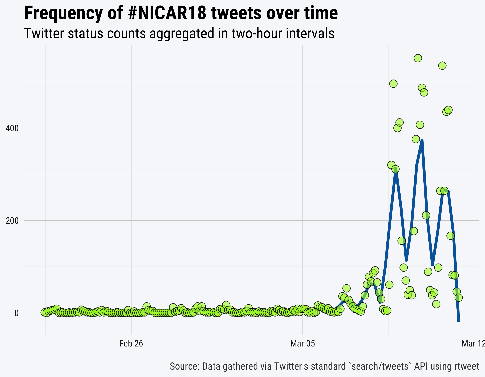
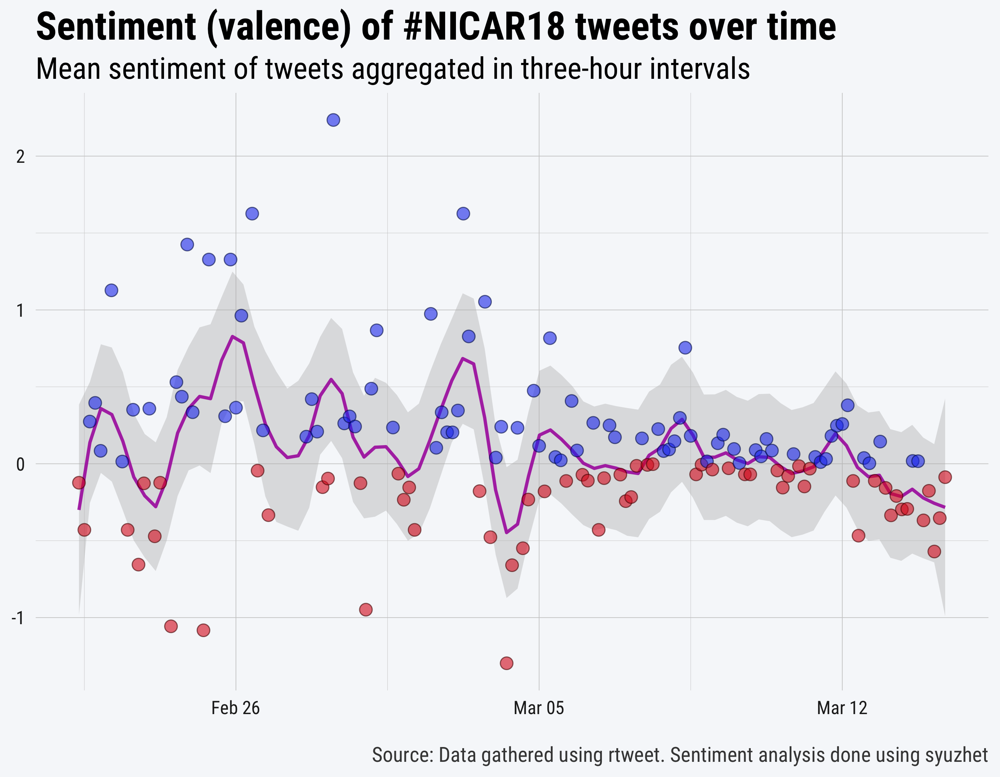

NICAR18 Tweets
==============
================

-   [Data](#data)
    -   [rtweet](#rtweet)
    -   [Search](#search)
-   [Explore](#explore)
    -   [Tweet frequency over time](#tweet-frequency-over-time)
    -   [Positive/negative sentiment](#positivenegative-sentiment)
    -   [Semantic networks](#semantic-networks)

This is a dedicated repository for tracking [\#NICAR18 tweets](https://twitter.com/hashtag/NICAR18?f=tweets&vertical=default&src=hash) (the official hashtag of 2018 annual Computer-Assisted Reporting Conference).

Data
----

### rtweet

Whether you lookup the status IDs or search/stream new tweets, you'll need to make sure to install the [rtweet](http://rtweet.info) package. The code below will install \[if it's not already\] and load rtweet.

``` r
## install rtweet if not already
if (!requireNamespace("rtweet", quietly = TRUE)) {
  install.packages("rtweet")
}

## load rtweet
library(rtweet)
```

Our data collection method is described in detail below. However, if you want to get straight to the data, simply run the following code:

``` r
## download status IDs file
download.file(
  "https://github.com/computer-assisted-reporting/NICAR18/blob/master/data/search-ids.rds?raw=true",
  "NICAR18_status_ids.rds"
)

## read status IDs fromdownloaded file
ids <- readRDS("NICAR18_status_ids.rds")

## lookup data associated with status ids
rt <- rtweet::lookup_tweets(ids$status_id)
```

### Search

One of the easiest ways to gather Twitter data is to search for the data (using Twitter's REST API). Unlike streaming, searching makes it possible to go back in time. Unfortunately, Twitter sets a rather restrictive cap–roughly nine days–on how far back you can go. Regardless, searching for tweets is often the preferred method. For example, the code below is setup in such a way that it can be executed once \[or even several times\] a day throughout the conference. See the [R code here](R/search.R).

Here's some example code showing what essentially we're doing to collect the data:

``` r
## search terms
nicar18conf <- c("NICAR18", "NICAR2018", "IRE_NICAR")

## search for up to 10,000 tweets mentioning nicar18
rt <- search_tweets(paste(nicar18conf, collapse = " OR "), n = 10000)
```

Explore
-------

To explore the Twitter data, we recommend using the [tidyverse](http://tidyverse.org) packages. We're also using a customized [ggplot2](http://ggplot2.org) theme. See the [R code here](R/tidyggplot.R).

### Tweet frequency over time

To create the image below, the data were summarized into a time series-like data frame and then plotted in order depict the frequency of tweets–aggregated in two-hour intevals–about \#nicar18 over time. See the [R code here](R/ts.R).

<p align="center">

</p>
 

### Positive/negative sentiment

Next, some sentiment analysis of the tweets so far. See the [R code here](R/sentiment.R).

<p align="center">

</p>
 

### Semantic networks

The image below depicts a quick and dirty visualization of the semantic network (connections via retweet, quote, mention, or reply) as it is observed in the data. See the [R code here](R/network.R).

<p align="center">

</p>
 

Ideally, the network visualization would be an interactive, searchable graphic. Since it's not, I've printed out the node size values below.

|  rank| screen\_name                                                       |  log\_n|
|-----:|:-------------------------------------------------------------------|-------:|
|     1| <a href="https://twitter.com/IRE_NICAR">@IRE\_NICAR</a>            |   5.908|
|     2| <a href="https://twitter.com/MacDiva">@MacDiva</a>                 |   4.105|
|     3| <a href="https://twitter.com/sharon000">@sharon000</a>             |   3.338|
|     4| <a href="https://twitter.com/jeremybowers">@jeremybowers</a>       |   3.303|
|     5| <a href="https://twitter.com/palewire">@palewire</a>               |   3.157|
|     6| <a href="https://twitter.com/DougHaddix">@DougHaddix</a>           |   3.157|
|     7| <a href="https://twitter.com/sarhutch">@sarhutch</a>               |   3.119|
|     8| <a href="https://twitter.com/knightlab">@knightlab</a>             |   3.119|
|     9| <a href="https://twitter.com/albertocairo">@albertocairo</a>       |   3.080|
|    10| <a href="https://twitter.com/asduner">@asduner</a>                 |   3.001|
|    11| <a href="https://twitter.com/bymarkwalker">@bymarkwalker</a>       |   3.001|
|    12| <a href="https://twitter.com/charlesminshew">@charlesminshew</a>   |   2.917|
|    13| <a href="https://twitter.com/JSKstanford">@JSKstanford</a>         |   2.831|
|    14| <a href="https://twitter.com/mgafni">@mgafni</a>                   |   2.831|
|    15| <a href="https://twitter.com/sarambsimon">@sarambsimon</a>         |   2.831|
|    16| <a href="https://twitter.com/rachel_shorey">@rachel\_shorey</a>    |   2.831|
|    17| <a href="https://twitter.com/myersjustinc">@myersjustinc</a>       |   2.786|
|    18| <a href="https://twitter.com/thomasgpadilla">@thomasgpadilla</a>   |   2.786|
|    19| <a href="https://twitter.com/miriamkp">@miriamkp</a>               |   2.740|
|    20| <a href="https://twitter.com/cephillips">@cephillips</a>           |   2.692|
|    21| <a href="https://twitter.com/Danict89">@Danict89</a>               |   2.692|
|    22| <a href="https://twitter.com/gebeloffnyt">@gebeloffnyt</a>         |   2.644|
|    23| <a href="https://twitter.com/DrewOCCRP">@DrewOCCRP</a>             |   2.644|
|    24| <a href="https://twitter.com/carla_astudi">@carla\_astudi</a>      |   2.594|
|    25| <a href="https://twitter.com/ultracasual">@ultracasual</a>         |   2.542|
|    26| <a href="https://twitter.com/MaryJoWebster">@MaryJoWebster</a>     |   2.434|
|    27| <a href="https://twitter.com/ndiakopoulos">@ndiakopoulos</a>       |   2.378|
|    28| <a href="https://twitter.com/kristinhussey1">@kristinhussey1</a>   |   2.378|
|    29| <a href="https://twitter.com/SStirling">@SStirling</a>             |   2.378|
|    30| <a href="https://twitter.com/IJNet">@IJNet</a>                     |   2.319|
|    31| <a href="https://twitter.com/opennews">@opennews</a>               |   2.319|
|    32| <a href="https://twitter.com/sandhya__k">@sandhya\_\_k</a>         |   2.319|
|    33| <a href="https://twitter.com/KCnSunshineJam">@KCnSunshineJam</a>   |   2.258|
|    34| <a href="https://twitter.com/emamd">@emamd</a>                     |   2.258|
|    35| <a href="https://twitter.com/TimBroderick">@TimBroderick</a>       |   2.258|
|    36| <a href="https://twitter.com/lucyparsonslabs">@lucyparsonslabs</a> |   2.258|
|    37| <a href="https://twitter.com/euniceylee">@euniceylee</a>           |   2.194|
|    38| <a href="https://twitter.com/JournalismSandy">@JournalismSandy</a> |   2.194|
|    39| <a href="https://twitter.com/hadleywickham">@hadleywickham</a>     |   2.194|
|    40| <a href="https://twitter.com/mtdukes">@mtdukes</a>                 |   2.194|
|    41| <a href="https://twitter.com/bugsact">@bugsact</a>                 |   2.127|
|    42| <a href="https://twitter.com/city_bureau">@city\_bureau</a>        |   2.127|
|    43| <a href="https://twitter.com/AxiosVisuals">@AxiosVisuals</a>       |   2.127|
|    44| <a href="https://twitter.com/NYTInteractive">@NYTInteractive</a>   |   2.057|
|    45| <a href="https://twitter.com/saleemkhan">@saleemkhan</a>           |   2.057|
|    46| <a href="https://twitter.com/JoeGermuska">@JoeGermuska</a>         |   2.057|
|    47| <a href="https://twitter.com/JadJaffar">@JadJaffar</a>             |   1.983|
|    48| <a href="https://twitter.com/merbroussard">@merbroussard</a>       |   1.983|
|    49| <a href="https://twitter.com/CaitMcGlade">@CaitMcGlade</a>         |   1.983|
|    50| <a href="https://twitter.com/JOVRNALISM">@JOVRNALISM</a>           |   1.983|
|    51| <a href="https://twitter.com/ChiDM">@ChiDM</a>                     |   1.983|
|    52| <a href="https://twitter.com/christinezhang">@christinezhang</a>   |   1.983|
|    53| <a href="https://twitter.com/robertrdenton">@robertrdenton</a>     |   1.905|
|    54| <a href="https://twitter.com/Lindenberger">@Lindenberger</a>       |   1.905|
|    55| <a href="https://twitter.com/citizenkrans">@citizenkrans</a>       |   1.905|
|    56| <a href="https://twitter.com/TWallack">@TWallack</a>               |   1.905|
|    57| <a href="https://twitter.com/abtran">@abtran</a>                   |   1.905|
|    58| <a href="https://twitter.com/amber_waves">@amber\_waves</a>        |   1.822|
|    59| <a href="https://twitter.com/PBienenfeld">@PBienenfeld</a>         |   1.822|
|    60| <a href="https://twitter.com/derekeder">@derekeder</a>             |   1.822|
|    61| <a href="https://twitter.com/jbenton">@jbenton</a>                 |   1.822|
|    62| <a href="https://twitter.com/morisy">@morisy</a>                   |   1.822|
|    63| <a href="https://twitter.com/cbaxter1">@cbaxter1</a>               |   1.822|
|    64| <a href="https://twitter.com/Disha_RC">@Disha\_RC</a>              |   1.822|
|    65| <a href="https://twitter.com/martinstabe">@martinstabe</a>         |   1.822|
|    66| <a href="https://twitter.com/jpheasly">@jpheasly</a>               |   1.732|
|    67| <a href="https://twitter.com/emilywithrow">@emilywithrow</a>       |   1.732|
|    68| <a href="https://twitter.com/ravenben">@ravenben</a>               |   1.732|
|    69| <a href="https://twitter.com/NewsbySchmidt">@NewsbySchmidt</a>     |   1.732|
|    70| <a href="https://twitter.com/gerald_arthur">@gerald\_arthur</a>    |   1.732|
|    71| <a href="https://twitter.com/ByNinaMartin">@ByNinaMartin</a>       |   1.732|
|    72| <a href="https://twitter.com/npenzenstadler">@npenzenstadler</a>   |   1.732|
|    73| <a href="https://twitter.com/ChiAppleseed">@ChiAppleseed</a>       |   1.732|
|    74| <a href="https://twitter.com/davidherzog">@davidherzog</a>         |   1.732|
|    75| <a href="https://twitter.com/haddadme">@haddadme</a>               |   1.636|
|    76| <a href="https://twitter.com/Orla_McCaffrey">@Orla\_McCaffrey</a>  |   1.636|
|    77| <a href="https://twitter.com/schwanksta">@schwanksta</a>           |   1.636|
|    78| <a href="https://twitter.com/justinJprice">@justinJprice</a>       |   1.636|
|    79| <a href="https://twitter.com/allisonsross">@allisonsross</a>       |   1.636|
|    80| <a href="https://twitter.com/SooOh">@SooOh</a>                     |   1.636|
|    81| <a href="https://twitter.com/stiles">@stiles</a>                   |   1.636|
|    82| <a href="https://twitter.com/AditiHBhandari">@AditiHBhandari</a>   |   1.531|
|    83| <a href="https://twitter.com/ByJohnRRoby">@ByJohnRRoby</a>         |   1.531|
|    84| <a href="https://twitter.com/tiffehr">@tiffehr</a>                 |   1.531|
|    85| <a href="https://twitter.com/DJNF">@DJNF</a>                       |   1.531|
|    86| <a href="https://twitter.com/rararahima">@rararahima</a>           |   1.414|
|    87| <a href="https://twitter.com/greglinch">@greglinch</a>             |   1.414|
|    88| <a href="https://twitter.com/kleinmatic">@kleinmatic</a>           |   1.414|
|    89| <a href="https://twitter.com/jasongrotto">@jasongrotto</a>         |   1.414|
|    90| <a href="https://twitter.com/j_la28">@j\_la28</a>                  |   1.414|
|    91| <a href="https://twitter.com/mattdrange">@mattdrange</a>           |   1.414|
|    92| <a href="https://twitter.com/ChadSDay">@ChadSDay</a>               |   1.414|
|    93| <a href="https://twitter.com/jonkeegan">@jonkeegan</a>             |   1.414|
|    94| <a href="https://twitter.com/MikeStucka">@MikeStucka</a>           |   1.414|
|    95| <a href="https://twitter.com/kschorsch">@kschorsch</a>             |   1.414|
|    96| <a href="https://twitter.com/brentajones">@brentajones</a>         |   1.282|
|    97| <a href="https://twitter.com/dataeditor">@dataeditor</a>           |   1.282|
|    98| <a href="https://twitter.com/MargotWilliams">@MargotWilliams</a>   |   1.282|
|    99| <a href="https://twitter.com/_thetextfiles">@\_thetextfiles</a>    |   1.282|
|   100| <a href="https://twitter.com/forestgregg">@forestgregg</a>         |   1.282|
|   101| <a href="https://twitter.com/NiemanLab">@NiemanLab</a>             |   1.282|
|   102| <a href="https://twitter.com/WSJGraphics">@WSJGraphics</a>         |   1.282|
|   103| <a href="https://twitter.com/elliot_bentley">@elliot\_bentley</a>  |   1.282|
|   104| <a href="https://twitter.com/write_this_way">@write\_this\_way</a> |   1.282|
|   105| <a href="https://twitter.com/SamanthaSunne">@SamanthaSunne</a>     |   1.282|
|   106| <a href="https://twitter.com/becca_aa">@becca\_aa</a>              |   1.282|
|   107| <a href="https://twitter.com/ofadam">@ofadam</a>                   |   1.129|
|   108| <a href="https://twitter.com/AgNews_Otto">@AgNews\_Otto</a>        |   1.129|
|   109| <a href="https://twitter.com/hunter_owens">@hunter\_owens</a>      |   1.129|
|   110| <a href="https://twitter.com/MateoClarke">@MateoClarke</a>         |   1.129|
|   111| <a href="https://twitter.com/DataMadeCo">@DataMadeCo</a>           |   1.129|
|   112| <a href="https://twitter.com/StefanieMurray">@StefanieMurray</a>   |   1.129|
|   113| <a href="https://twitter.com/UO_Catalyst">@UO\_Catalyst</a>        |   1.129|
|   114| <a href="https://twitter.com/MadiLAlexander">@MadiLAlexander</a>   |   1.129|
|   115| <a href="https://twitter.com/KarrieKehoe">@KarrieKehoe</a>         |   0.944|
|   116| <a href="https://twitter.com/BBGVisualData">@BBGVisualData</a>     |   0.944|
|   117| <a href="https://twitter.com/hannah_recht">@hannah\_recht</a>      |   0.944|
|   118| <a href="https://twitter.com/kearneymw">@kearneymw</a>             |   0.944|
|   119| <a href="https://twitter.com/Riogringa">@Riogringa</a>             |   0.944|
|   120| <a href="https://twitter.com/kissane">@kissane</a>                 |   0.944|
|   121| <a href="https://twitter.com/EvaConstantaras">@EvaConstantaras</a> |   0.702|
|   122| <a href="https://twitter.com/crit">@crit</a>                       |   0.702|
|   123| <a href="https://twitter.com/JaymeKFraser">@JaymeKFraser</a>       |   0.702|
|   124| <a href="https://twitter.com/zammagazine">@zammagazine</a>         |   0.702|
|   125| <a href="https://twitter.com/pinardag">@pinardag</a>               |   0.702|
|   126| <a href="https://twitter.com/BrettMmurphy">@BrettMmurphy</a>       |   0.333|
|   127| <a href="https://twitter.com/mediatwit">@mediatwit</a>             |   0.333|
|   128| <a href="https://twitter.com/MediaShiftOrg">@MediaShiftOrg</a>     |   0.333|
|   129| <a href="https://twitter.com/FrancescaFionda">@FrancescaFionda</a> |   0.333|
|   130| <a href="https://twitter.com/DiannaNanez">@DiannaNanez</a>         |   0.333|
